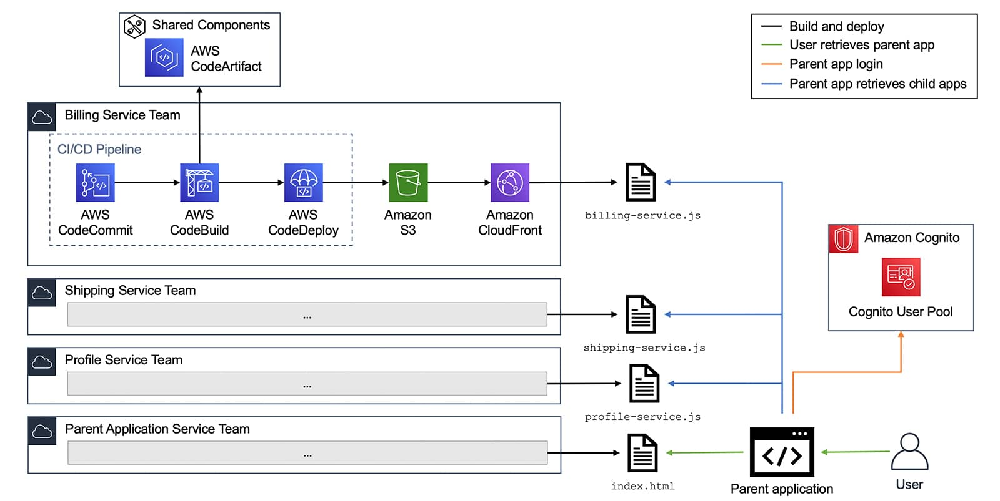

# 参考架构

## 认证

Identity and Access Management (IAM) 解决方案

认证

- Amazon Cognito
    - Cognito User Pool

单点登录 SSO 解决方案

## 登录

密码加密

[bcrypt - npm (npmjs.com)](https://www.npmjs.com/package/bcrypt)

[How To Safely Store A Password | codahale.com](https://codahale.com/how-to-safely-store-a-password/)

单点登录

[What is SSO (Episode 7) - by Alex Xu (bytebytego.com)](https://blog.bytebytego.com/p/what-is-sso-episode-7?utm_source=%2Fsearch%2FSSO&utm_medium=reader2)

[Password, Session, Cookie, Token, JWT, SSO, OAuth - Authentication Explained - Part 1 (bytebytego.com)](https://blog.bytebytego.com/p/password-session-cookie-token-jwt)

[Password, Session, Cookie, Token, JWT, SSO, OAuth - Authentication Explained - Part 2 (bytebytego.com)](https://blog.bytebytego.com/p/password-session-cookie-token-jwt-ec1)

[EP34: Session, cookie, JWT, token, SSO, and OAuth (bytebytego.com)](https://blog.bytebytego.com/p/ep34-session-cookie-jwt-token-sso)

无服务器App

[Structuring a Real-World Serverless App](https://www.serverless.com/blog/structuring-a-real-world-serverless-app)

[Serverless Project Code Structure for AWS Serverless E-Commerce Architecture | by Mehmet Ozkaya | AWS Serverless Microservices with Patterns & Best Practices | Medium](https://medium.com/aws-serverless-microservices-with-patterns-best/serverless-project-code-structure-for-aws-serverless-e-commerce-architecture-e5015a0d6778)

[Best practices for organizing larger serverless applications | AWS Compute Blog (amazon.com)](https://aws.amazon.com/blogs/compute/best-practices-for-organizing-larger-serverless-applications/)

[Anatomy of a Serverless Application](https://www.serverless.com/blog/anatomy-of-a-serverless-app/)

https://github.com/erezrokah/serverless-monorepo-app

## 前台

前台

- S3
- CloudFront (CDN)

## 素材

图形素材

- [Vector Icons and Stickers - PNG, SVG, EPS, PSD and CSS (flaticon.com)](https://www.flaticon.com/)
- [Illustrations | unDraw](https://undraw.co/illustrations)
- [矢量图， 矢量图库免费下载 - 站长素材 (chinaz.com)](https://sc.chinaz.com/shiliang/)
- [素材天下_矢量图库_素材CNN_素材中国 (sccnn.com)](http://www.sccnn.com/shiliangtuku/)

设计工具

- [免费设计工具：设计制作演示文稿、视频、社交媒体等 - Canva](https://www.canva.com/zh_cn/)

## 基本架构EC2

- 前台
    - S3
    - CloudFront (CDN)
- 后台
    - Application Load Balancer (ALB)
    - EC2 (2台或扩展组)

## 基本架构Serverless

- 前台
    - S3
    - CloudFront (CDN)
- 后台
    - API Gateway
    - Lambda

## 可观测性

- 可观测性
    - ELK
        - ElasticSearch
        - Logstach
        - Kibana
    - Splunk
    - Datadog
    - Grafana
    - Graydog
    - Sumo

## 数据缓存

- 缓存
    - ElasiCache for Redis

## 数据库

- 数据库
    - DynamoDB
    - RDS for PostgreSQL

## CI/CD

共享组件服务

- AWS CodeArtifact

CI/CD管道

- AWS CodeCommit
- AWS CodeBuild
- AWS CodeDeploy



## 技术栈

- **React + Next.js** front-end with **Tailwind**
- **Next.js** or **Express** derivative back-end
- **Prisma** (+ **Apollo** if using GraphQL)
- **Postgres** (flavored), **Mongo**, **Firestore**, or **Dynamo** database
- Python based backends if the company is doing any ML

React: [React](https://react.dev/)

Next.js: [Next.js by Vercel - The React Framework (nextjs.org)](https://nextjs.org/)

Tailwind: [Tailwind CSS - Rapidly build modern websites without ever leaving your HTML.](https://tailwindcss.com/)

Express: [Express - Node.js web application framework (expressjs.com)](https://expressjs.com/)

Prisma: [Prisma | Next-generation ORM for Node.js & TypeScript](https://www.prisma.io/)

Apollo: [Apollo GraphQL | Supergraph: unify APIs, microservices, & databases in a composable graph](https://www.apollographql.com/)

Postgres: [PostgreSQL: The world's most advanced open source database](https://www.postgresql.org/)

MongoDB: https://www.mongodb.com/

Firestore: https://firebase.google.com/

DynamoDB: [Fast NoSQL Key-Value Database – Amazon DynamoDB – Amazon Web Services](https://aws.amazon.com/dynamodb/)

Python: [Welcome to Python.org](https://www.python.org/)

## React

React: [React](https://react.dev/)

在线编辑器

[React - CodeSandbox](https://codesandbox.io/s/new)

[React (forked) - StackBlitz](https://stackblitz.com/edit/react-gqfpys?file=src%2FApp.js)

[Create a New Pen (codepen.io)](https://codepen.io/pen?&editors=0010&layout=left)

[React - Login Form](https://www.notion.so/React-Login-Form-6533916690a74393adb72f18b7700eab?pvs=21)

创建React App
```Bash
npx create-next-app
```