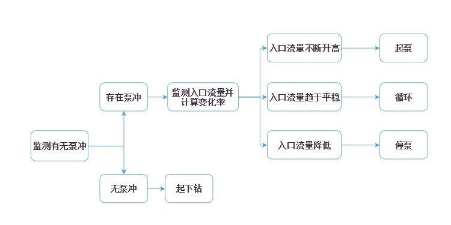
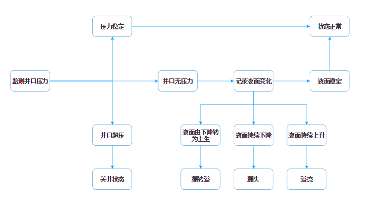

# 会议记录 2

设计原则

- 数据可配置 - 通过设备元数据对设备进行配置，减少输入错误。
- 数据可采集 - 通过WITS或COM通信将数据传回应用，并通过应用控制数据的同步和储存。
- 数据可视化 - 可将实时采集和计算得到的数据通过折线图进行可视化展示，方便对比分析。
- 数据可导出 - 可通过数据导出和数据报表功能将数据导出或按报表模版生成报表。
- 数据可预警 - 通过报警阈值控制，当超出阈值自动预警，弹出报警消息，记录报警日志，仪表盘显示报警状态。

数据构造

- 配置数据
    - 井深结构：
    - 环空：井深
    - 泥浆罐：类型、长、宽、高、体积
- 采集数据
    - 环空：液面高度
    - 泥浆罐：液面高度
- 计算数据
    - 环空：液体体积 (计算公式?) 、体积变化百分比？(时间间隔?)
    - 泥浆罐：泥浆罐液体体积 (计算公式?)、体积变化百分比？(时间间隔?)
- 报警计算及阈值
    - 环空：
    - 泥浆罐：

工况判定

- 泵冲 - 应该是实时数据，确认数据项名字
- 入口流量 - 应该是实时数据，确认数据项名字
- 不断升高/趋于平稳/流量降低 - 时间段? 变化率阈值?

- 井口压力 - 应该是实时数据，确认数据项名字
- 压力阈值 - 应该是配置项，确认数据项名字
- 压力稳定 - 时间段？阈值？
- 液面变化 - 时间段? 阈值?